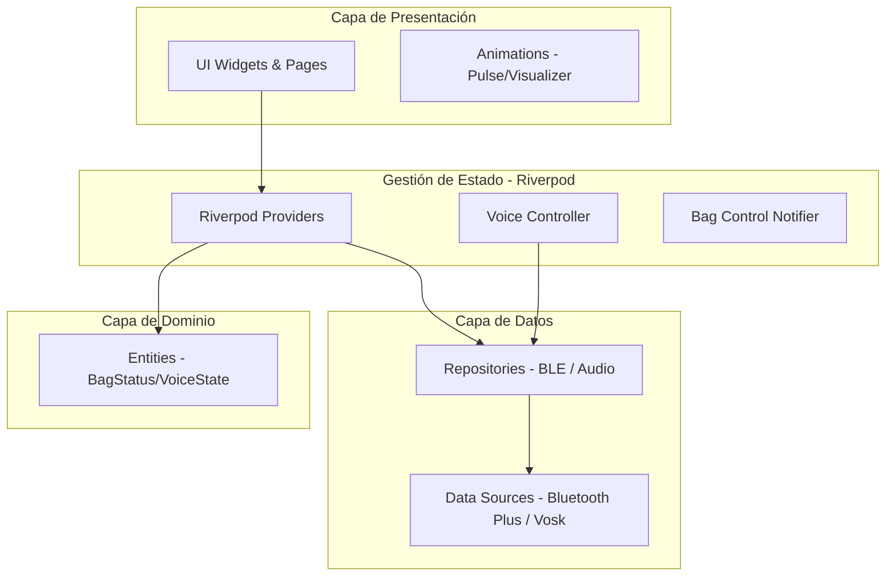
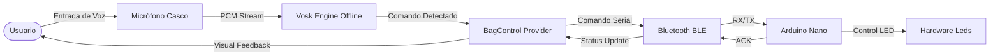
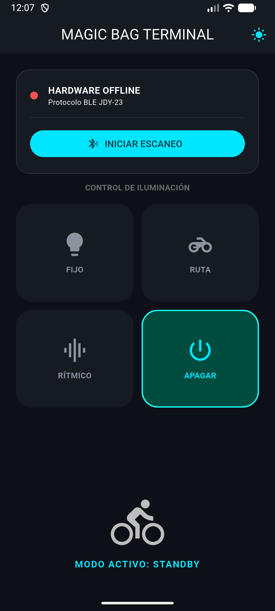
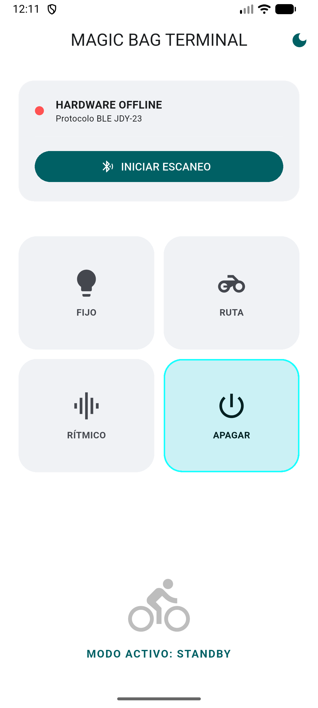
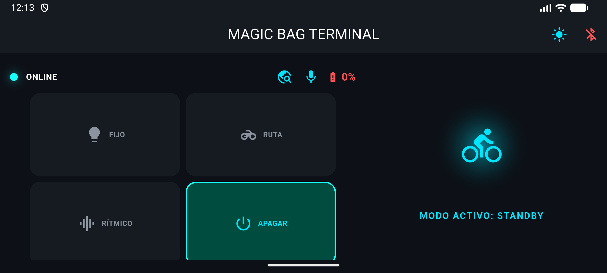
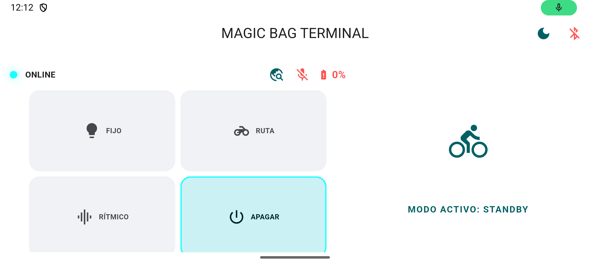

# Magic Bag 🎒✨

**Magic Bag** es una aplicación móvil desarrollada en Flutter diseñada para el control inteligente y la telemetría de un sistema de iluminación interactivo para maletas de motociclistas basado en **Arduino**. La aplicación permite gestionar diversos modos de iluminación mediante comandos de voz fuera de línea y una interfaz adaptativa de alta visibilidad, priorizando la seguridad y la facilidad de uso durante la conducción.

---

## 🏗️ Arquitectura del Proyecto

La aplicación sigue una arquitectura limpia (Clean Architecture) simplificada, organizada por capas para asegurar la escalabilidad y facilitar las pruebas unitarias.



---

## 🔄 Flujo Funcional (Control por Voz)

El siguiente diagrama detalla cómo se procesa una orden desde el micrófono del casco hasta la ejecución en el hardware físico utilizando diagramas de flujo:



---

## 🎨 UI & Diseño

El diseño ha sido concebido para entornos de alta exigencia (conducción en moto), utilizando una estética de **Terminal Moderna / Cyberpunk** que garantiza contraste y legibilidad.

### 🧩 Vista Previa
<p align="center">
  
  
  
  

</p>

### 🧩 Experiencia de Usuario (UX)
*   **Adaptabilidad Total:** La interfaz cambia dinámicamente entre modo **Portrait** (uso manual) y **Landscape** (montaje en manubrio).
*   **Modo PiP (Picture-in-Picture):** Permite controlar la maleta mediante una ventana flotante mientras el usuario mantiene Google Maps o Waze en primer plano.
*   **Feedback Visual:** Animaciones de pulso (`PulseAnimation`) sincronizadas con el estado de conexión y el modo activo.

### 🎨 Paleta de Colores & Estilo
*   **Fondo:** Negro Puro (`#000000`) para maximizar el contraste en pantallas OLED y reducir la fatiga visual nocturna.
*   **Primario:** Cyan Neón / Electric Blue para elementos activos.
*   **Tipografía:** Fuentes Sans-Serif de peso variable para jerarquizar la telemetría crítica (Batería, Estado).

---

## 📡 Protocolo de Comunicación BLE

La aplicación se comunica con el firmware del Arduino mediante comandos de caracteres ASCII transmitidos a través del servicio transparente UART del módulo **JDY-23**:

*   **Baud Rate por defecto:** `9600 bps`
*   **Service UUID por defecto (JDY-23):** `0000ffe0-0000-1000-8000-00805f9b34fb`
*   **Characteristic UUID:** `0000ffe1-0000-1000-8000-00805f9b34fb`

### Comandos Seriales:

| Comando ASCII | Acción en Hardware | Descripción |
| :--- | :--- | :--- |
| `'1'` | Leds en ON (Fijo) | Forzado de encendido constante para visibilidad máxima. |
| `'3'` | Patrón Dinámico | Activación del modo ruta (secuencia de alta visibilidad). |
| `'M'` | Modo Rítmico | Reacción visual en tiempo real basada en audio ambiental. |
| `'0'` | Leds en OFF | Estado de espera (Standby) sin desconexión BLE. |
| `'TURNOFF'` | Apagado Total | Desconexión total del sistema y cierre del enlace Bluetooth. |

---

## 🚀 Características Principales

*   **🔗 Conexión BLE (Bluetooth Low Energy):** Gestión robusta de conexión y reconexión automática con módulos JDY-23 / HM-10.
*   **🗣️ Control por Voz Offline:** Integración con el motor **Vosk** para procesar comandos de voz localmente (sin internet), optimizado para micrófonos de cascos (Bluetooth SCO).
*   **⚡ Modos de Iluminación:**
    *   **FIJO:** Luz constante para visibilidad máxima.
    *   **RUTA:** Patrón dinámico de alta visibilidad para trayectos.
    *   **RÍTMICO:** Reacción visual en tiempo real basada en el audio ambiental.
*   **🔋 Telemetría en Tiempo Real:** Monitorización constante del nivel de batería del hardware y estado de los comandos enviados.
*   **Shortcut Integración:** Acceso rápido a modos específicos mediante accesos directos de Android.

---

## 🛠️ Stack Tecnológico

*   **Framework:** [Flutter](https://flutter.dev/)
*   **Gestión de Estado:** [Riverpod](https://riverpod.dev/) (Generador de código y Anotaciones)
*   **Comunicación:** `flutter_blue_plus` (BLE)
*   **Inteligencia Artificial:** `vosk_flutter_service` (Offline STT)
*   **Audio:** `record` para captura de flujo PCM y `audio_visualizer`.
*   **Nativo:** Method Channels para control de micro Bluetooth y modo PiP.

---

## 📁 Estructura del Proyecto

```text
magic_bag/
├── assets/                  # Modelos de IA, iconos e imágenes.
├── lib/
│   ├── core/                # Elementos transversales.
│   │   ├── constants/       # Comandos seriales y configuraciones.
│   │   ├── di/              # Inyección de dependencias (GetIt).
│   │   ├── enums/           # Definiciones de tipos.
│   │   ├── errors/          # Manejo de excepciones.
│   │   ├── theme/           # Configuración visual (Dark/Light).
│   │   └── utils/           # Ayudantes de audio y lógica general.
│   ├── data/                # Implementación de datos.
│   │   ├── mappers/         # Conversión de DTOs a Entidades.
│   │   └── repositories/    # Implementación de repositorios (Bluetooth/Voz).
│   ├── domain/              # Lógica pura de negocio.
│   │   ├── entities/        # Modelos de estado (BagStatus).
│   │   ├── repositories/    # Contratos/Interfaces.
│   │   └── uses_cases/      # Casos de uso específicos.
│   ├── presentation/        # Capa de Interfaz de Usuario.
│   │   ├── animations/      # PulseAnimation y Visualizers.
│   │   ├── components/      # Botones y elementos reutilizables.
│   │   ├── pages/           # ControlPage (Pantalla principal).
│   │   └── widgets/         # Componentes específicos de la vista.
│   ├── providers/           # Gestión de estado con Riverpod.
│   │   ├── bag_control/     # Lógica principal de la maleta.
│   │   ├── bluetooth/       # Estado de la conexión BLE.
│   │   ├── microphone/      # Controlador de voz Vosk.
│   │   └── ui/              # Estado del tema y navegación.
│   └── main.dart            # Punto de entrada de la aplicación.
├── pubspec.yaml             # Configuración de dependencias.
└── README.md
```

---

## 🛠️ Requisitos e Instalación

### Pasos
1.  **Clonar el repositorio:**
    ```bash
    git clone https://github.com/geraltorres/magic_bag.git
    ```
2.  **Instalar dependencias:**
    ```bash
    flutter pub get
    ```
3.  **Configuración de Voz:**
    Descargar el modelo ligero de Vosk y ubicarlo en:
    `assets/models/vosk-model-small-es-0.42.zip`
4.  **Generación de Código (Riverpod & Annotations):**
    Este proyecto utiliza `riverpod_generator`. Es obligatorio generar los archivos `.g.dart` para que los providers funcionen:
    *   **Ejecutar una vez:**
        ```bash
        dart run build_runner build --delete-conflicting-outputs
        ```
    *   **Modo Observador (Watch):**
        ```bash
        dart run build_runner watch --delete-conflicting-outputs
        ```
5.  **Ejecutar:**
    ```bash
    flutter run
    ```

---

## 📄 Licencia

Este proyecto es privado y para uso personal.

---

**Desarrollado por [Geral Torres](https://github.com/geraltorres) 🏍️💨**
